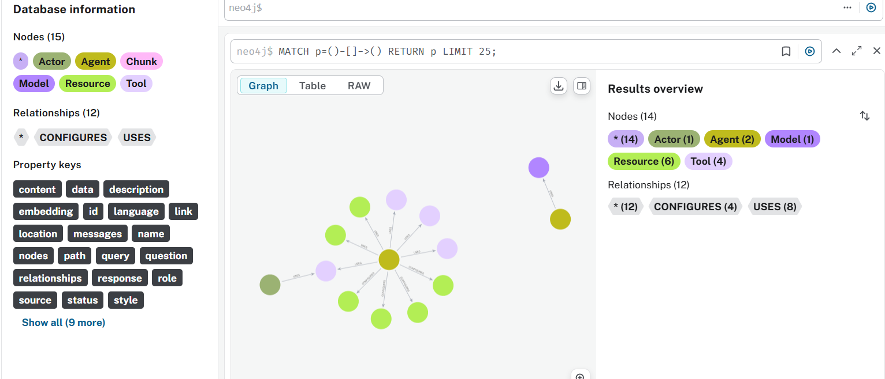
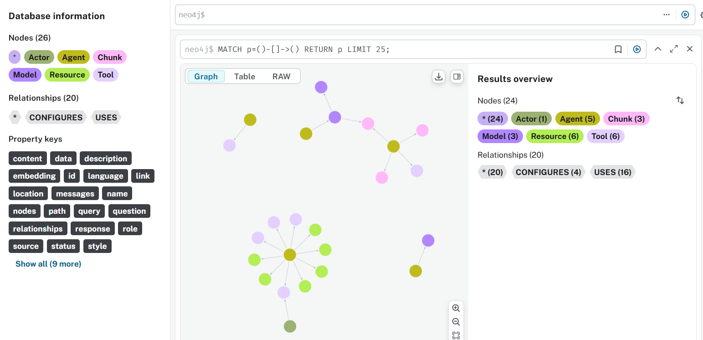
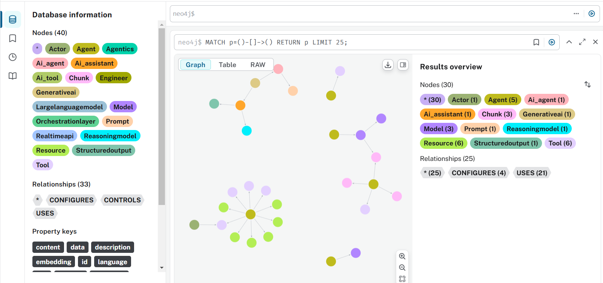
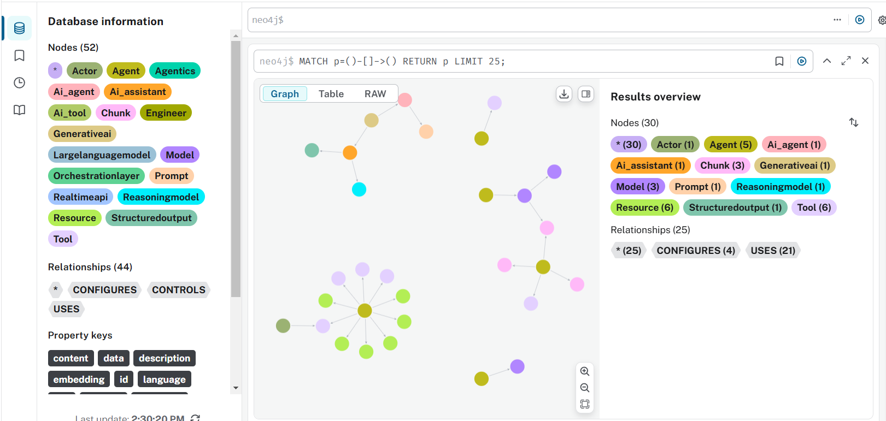
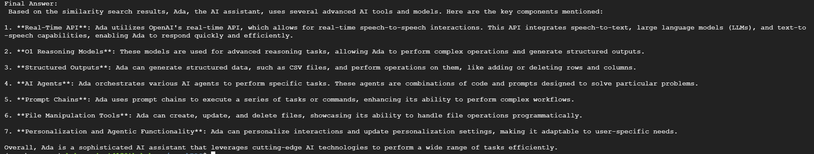

# Ultimate README for Graph Generation, Visualization, and Querying

Welcome to the **Knowledge Graph Generation and Querying** project! This repository provides tools to convert unstructured text into a knowledge graph, visualize the results, and query the graph using natural language.

---

## Table of Contents

1. [What the Project Does](#what-the-project-does)
2. [Installation](#installation)
   1. [Virtual Environment Setup](#virtual-environment-setup)
   2. [Environment Variables](#environment-variables)
3. [How to Operate](#how-to-operate)
   1. [Graph Generation](#graph-generation)
   2. [Graph Visualization](#graph-visualization)
   3. [Graph Generation Example](#full-sample-graph-generation-example)
   4. [Graph Querying](#graph-querying)
   5. [Graph Querying Example](#graph-querying-example)
4. [Advanced Documentation](#advanced-documentation)
5. [Troubleshooting Tips](#troubleshooting-tips)
6. [Additional Resources](#additional-resources)

---

## What the Project Does

This project automates the creation, visualization, and querying of a **Neo4j-based knowledge graph**. Specifically, it:

1. **Parses text** to extract meaningful entities and relationships.
2. **Dynamically or strictly** defines an ontology (node types, relationship types) using large language models.
3. **Generates and inserts** that knowledge into a Neo4j database.
4. **Visualizes** the resulting graph in an interactive HTML file.
5. **Executes** advanced graph queries using either user-provided Cypher or a natural language interface that translates text to Cypher.

---

## Installation

Below are the recommended steps to set up a local environment for running the project:

### Virtual Environment Setup

1. **Clone the repository**:
   ```bash
   git clone repo-url
   cd BabyProjectGraphRag
   ```
2. **Create and activate a virtual environment** (recommended):
   ```bash
   # On Linux / macOS
   python3 -m venv venv
   source venv/bin/activate

   # On Windows
   python -m venv venv
   venv\Scripts\activate
   ```
3. **Install dependencies**:
   ```bash
   pip install -r requirements.txt
   ```

### Environment Variables

Create a `.env` file (or export environment variables) with the following:

```
NEO4J_URI=bolt://localhost:7687
NEO4J_USERNAME=neo4j
NEO4J_PASSWORD=password
OPENAI_API_KEY=sk-...
```

- **`NEO4J_URI`**: The URI for your Neo4j instance (default is `bolt://localhost:7687`).
- **`NEO4J_USERNAME`**: Your Neo4j username.
- **`NEO4J_PASSWORD`**: Your Neo4j password.
- **`OPENAI_API_KEY`**: The API key for OpenAI LLM usage.

Ensure that your local or remote Neo4j database is running and accessible.

---

## How to Operate

### Graph Generation

The main entry point for generating knowledge graphs from text is **`memory_preprocessing.py`**. It reads your input text, decides on an ontology mode (Current, Custom, or Baseline), and then inserts data into Neo4j.

1. **Interactive Mode**: Simply run:

   ```bash
   python memory_preprocessing.py
   ```

   You will be prompted for:

   - The file path containing the text.
   - The ontology mode to use (Current/Custom/Baseline).
   - Whether to review suggestions interactively.

2. **Command-Line Arguments**: To run in a single command:

   ```bash
   python memory_preprocessing.py --file your_text_file.txt --mode custom --ontology-mode expressive --no-confirm
   ```

   **Common Arguments**:

   - `--file <PATH>`: The path to your text file.
   - `--mode <current|custom|baseline>`: The ontology mode.
   - `--ontology-mode <expressive|strict>`: Sub-mode for the `custom` ontology.
   - `--no-confirm`: Skip user confirmation prompts.
   - `--no-viz`: Disable visualization.

For a detailed explanation of ontology modes (Current, Custom, Baseline), see [GraphGen Documentation](https://github.com/StarkTechConsulting/BabyProjectGraphRag/blob/main/docs/graphgen_doc.md).

### Graph Visualization

When the generation process finishes, it automatically exports an interactive HTML file for visualization (unless disabled with `--no-viz`). The file is saved under `logs/graphs/` with a timestamp.

To **visualize**:

1. Open the generated `.html` file in your browser.
2. Pan/zoom around the nodes and edges to explore relationships.

You can also **manually run** the `visualize_graph.py` script to:

```bash
python visualize_graph.py
```

- This provides an interactive prompt for specifying a node name. If left blank, it will visualize the entire graph.

### Full Sample Graph Generation Example

1. Initially the graph is empty, so we opt for generating a graph using custom mode and use an expressive ontology

```bash
python memory_preprocessing.py --file assets/transcript.txt --mode custom --ontology-mode expressive --no-confirm

```


2. We then add more nodes and relationships by loading a second document using the same current ontology
```bash
python memory_preprocessing.py --file assets/transcript2.txt --mode current --no-confirm

```


We notice that we still have the same nodes and edges, but increased in number

3. Next we further populate our graph with the content of a third document. This time we add more node types and edges and use a strict ontology
```bash
python memory_preprocessing.py --file transcript3.txt --mode custom --ontology-mode strict --no-confirm

```


We notice that this time we have more node and edge types

4. Lastly, we generate a graph using a forth file, using the current ontology
```bash
python memory_preprocessing.py --file assets/new-script.txt --mode current --no-confirm
```



### Graph Querying

Use **`query_graph_advanced.py`** to query your Neo4j database in natural language. Internally, it:

1. Applies **guardrails** to ensure your query is domain-relevant.
2. Tries to generate a valid Cypher query from your question.
3. Validates and corrects the query if needed.
4. Executes the final Cypher.
5. Performs a **similarity search** if no direct results are found.

### Graph Querying Example

```bash
python query_graph_advanced.py "What does Ada use?"
```


**Program Flow**:

- **Guardrails**: Checks if the question is domain-specific.
- **Text2Cypher**: Generates a raw Cypher query.
- **Validation/Correction**: Fixes syntax or schema mismatches.
- **Execution**: Runs the query and returns results.
- **Similarity Search**: Falls back to embeddings-based search if no direct match.

---

## Advanced Documentation

For an in-depth look at how ontologies are managed, how nodes and relationships are labeled, and how you can customize the knowledge graph pipeline, see the **[Graph Generation Documentation](https://github.com/StarkTechConsulting/BabyProjectGraphRag/blob/main/docs/graphgen_doc.md)**.

---

## Troubleshooting Tips

1. **Neo4j Connection Refused**: Make sure Neo4j is running (e.g., via `systemctl start neo4j` or Docker if you’re using containerized Neo4j).
2. **Empty Ontology**: Check if you passed the correct file path or if your input text has relevant data.
3. **Invalid API Key**: Verify your `OPENAI_API_KEY` in the `.env` file.
4. **Visualization Not Displaying**: Ensure your browser allows local HTML files.

---

## Additional Resources

- **Neo4j Official Documentation**: [https://neo4j.com/docs/](https://neo4j.com/docs/)
- **OpenAI Documentation**: [https://platform.openai.com/docs/](https://platform.openai.com/docs/)
- **LangChain**: [https://langchain.readthedocs.io/](https://langchain.readthedocs.io/)


