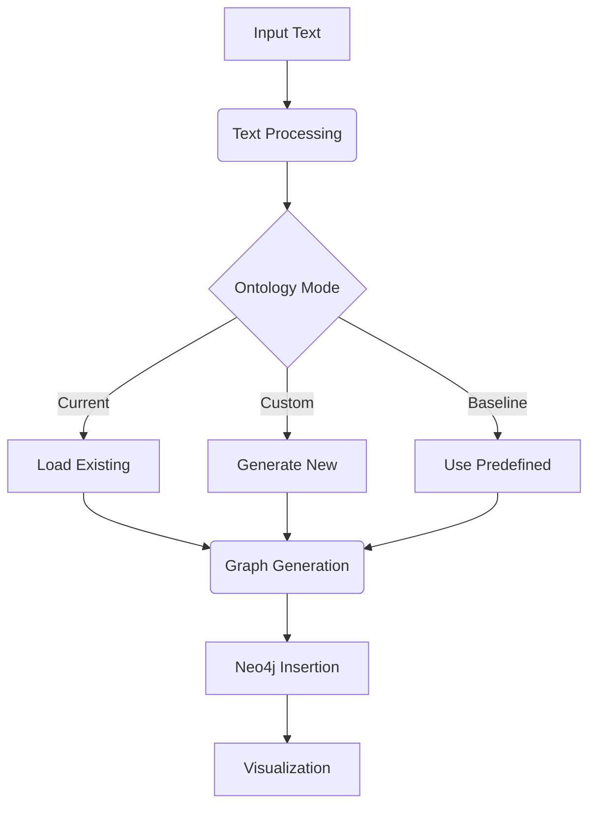

# Knowledge Graph Generation System Documentation

## System Architecture


The system consists of these core modules:
1. Text Processing
2. Ontology Management
3. Graph Generation
4. Neo4j Integration
5. Visualization
6. Ontology Export/Import

---

## Module Documentation

### 1. Text Processing Module (`load_data.py`)

#### `TextProcessor` Class
```python
class TextProcessor:
    def __init__(self, file_path: str):
        self.file_path = file_path

    def load_text() -> Optional[List[Document]]
```

**Responsibilities**:
- Load and concatenate text from input files
- Handle text loading errors
- Return LangChain Document objects

**Methods**:
- `load_text()`: Main entry point that:
  - Uses LangChain's TextLoader
  - Combines multi-page documents
  - Returns unified Document object

---

### 2. Ontology Management Module (`generate_graph.py`)

#### Core Classes:
```python
class OntologyEnhancer:
    def suggest_enhancements(text: str) -> Ontology
    def merge_ontologies(ontologies: List[Ontology]) -> Ontology
    def process_multiple_texts(texts: List[str]) -> Ontology

class Node(BaseModel):
    # Node type definition

class Relationship(BaseModel):
    # Relationship type definition
```

**Key Functionality**:
- Schema-aware ontology suggestions
- Multi-source ontology merging
- Interactive ontology review
- Existing schema integration

**Methods**:
- `suggest_enhancements()`: Generates new ontology elements based on text analysis
- `merge_ontologies()`: Combines multiple ontology suggestions using LLM
- `process_multiple_texts()`: Full processing pipeline with user interaction

--- 

### Ontology Modes in Graph Generation

In the knowledge graph generation process, the **ontology mode** defines how nodes and relationships are selected and structured. The system provides three distinct ontology modes:

### 1. **Current Mode**

In **Current Mode**, the system utilizes the existing ontology stored in the Neo4j database. This means that new graphs will strictly follow the node labels and relationships already present in your database. This mode is ideal for maintaining consistency in an evolving knowledge graph while preventing the introduction of unverified ontology elements.

#### **Workflow in Current Mode**
1. The system retrieves the existing ontology (node labels and relationship types) from the Neo4j database.
2. The input text is processed to extract relevant entities and relationships.
3. Only entities and relationships that match the existing ontology are included.
4. The graph is generated and integrated into the database without modifying the underlying schema.

#### **When to Use Current Mode**
- When working with an **established knowledge graph** and ensuring compliance with its structure.
- When integrating **new data into an existing framework** without modifying ontology definitions.
- When you need **strict adherence** to predefined relationships and node types.

#### **Command-Line Usage**
```bash
python memory_preprocessing.py --file input.txt --mode current
```

---

### 2. **Custom Mode**

In **Custom Mode**, the system dynamically generates a new ontology based on the input text. This mode allows for greater flexibility and is useful when dealing with new, unstructured data that may introduce novel concepts.

#### **Workflow in Custom Mode**
1. The system analyzes the input text and extracts potential node labels and relationships.
2. A **large language model (LLM)** suggests an enhanced ontology based on domain knowledge and detected patterns.
3. The system offers an interactive review process (optional) to refine the ontology before graph generation.
4. The finalized ontology is then used to structure the graph and update the Neo4j database.

#### **Modes within Custom Mode**
- **Expressive Mode**: Allows free-form relationship descriptions for broader, more adaptable ontologies.
- **Strict Mode**: Enforces structured relationships, such as hierarchical connections (`ChildEntity -> ParentEntity`).

#### **When to Use Custom Mode**
- When processing **new domains or datasets** that do not fit within an existing ontology.
- When needing **ontology evolution** to capture novel relationships dynamically.
- When developing a **prototype** for a knowledge graph before enforcing a strict schema.

#### **Command-Line Usage**
```bash
python memory_preprocessing.py --file input.txt --mode custom --ontology-mode expressive
```

---

### 3. **Baseline Mode**

In **Baseline Mode**, a predefined, standardized ontology is used. This ontology follows a general AI/ML-based schema, making it suitable for scenarios where no prior knowledge graph exists but a structured foundation is needed.

#### **Workflow in Baseline Mode**
1. The system loads a **predefined ontology** with standard node labels and relationship types.
2. The input text is analyzed, and entities/relationships are mapped to the predefined schema.
3. Any non-matching entities or relationships are excluded to maintain a clean structure.
4. The graph is generated based on the standardized baseline ontology.

#### **Predefined Ontology in Baseline Mode**
The **Baseline Ontology** includes general AI and technical terms, such as:
- **Nodes**: `AI_Orchestrator`, `AI_Agent`, `Model`, `Task`, `Workflow`, `Artifact`, `User`, etc.
- **Relationships**: `EXECUTES`, `COMPRISES`, `UTILIZES`, `GENERATES`, `ANALYZES`, etc.

#### **When to Use Baseline Mode**
- When **starting from scratch** and needing a structured foundation.
- When working with **technical AI-related content** and want to adopt a standardized ontology.
- When enforcing a **consistent schema across multiple projects**.

#### **Command-Line Usage**
```bash
python memory_preprocessing.py --file input.txt --mode baseline
```

---

## Choosing the Right Mode

| Mode | Best Use Case | Schema Flexibility | Requires Existing Ontology |
|------|-------------|-------------------|----------------------------|
| **Current** | Structured datasets with a known ontology | Low (strict adherence) | Yes |
| **Custom** | New datasets with evolving ontology needs | High (dynamically generated) | No |
| **Baseline** | General AI/ML-based knowledge graph | Medium (fixed but broad schema) | No |


---

### 3. Graph Generation Module (`generate_graph.py`)

#### `GraphGenerator` Class
```python
class GraphGenerator:
    def __init__(self, node_labels, relationship_labels)
    def generate_graph(documents) -> List[Document]
```

**Responsibilities**:
- Configure LLM graph transformer
- Generate knowledge graph triples
- Validate against allowed ontology
- Handle graph transformation errors

---

### 4. Neo4j Integration Module (`generate_graph.py`)

#### `Graph` Class
```python
class Graph:
    def __init__(self, uri, username, password)
    def add_graph(graph_documents) -> bool
```

**Functionality**:
- Manage Neo4j connection
- Bulk insert graph documents
- Transaction error handling
- Connection validation

---

### 5. Ontology Export/Import Module (`generate_from_file.py`)

#### Key Functions:
```python
def export_current_ontology_to_json() -> Dict
def get_nodes_rels_from_current_ontology_file() -> Tuple
```

**Features**:
- JSON-based ontology serialization
- Schema versioning
- Cross-environment ontology transfer
- Empty ontology detection

---

## Execution Flow


---

## Full System Documentation

### Environment Setup
```env
# .env file requirements
NEO4J_URI=bolt://localhost:7687
NEO4J_USERNAME=neo4j
NEO4J_PASSWORD=password
OPENAI_API_KEY=sk-...
```

### Installation
```bash
pip install -r requirements.txt
# requirements.txt
langchain_openai
langchain
neo4j
python-dotenv
inquirer
```

---

## Operational Modes

### 1. Interactive Mode
```bash
python memory_preprocessing.py
```

**Workflow**:
1. File path input
2. Mode selection menu
3. Real-time ontology review
4. Progress visualization

### 2. Command-Line Mode
```bash
python memory_preprocessing.py --file input.txt --mode current --no-confirm
```

**Arguments**:
| Flag | Description | Required |
|------|-------------|----------|
| `--file` | Input text file path | Yes |
| `--mode` | `current/custom/baseline` | Yes |
| `--no-confirm` | Skip confirmations | No |
| `--no-viz` | Disable visualization | No |

---

## Advanced Configuration

### Ontology Merging Logic
```python
# Custom merge prompt example
merge_prompt = """Merge guidelines:
1. Preserve domain-specific terms
2. Combine hierarchical relationships
3. Maintain AI/ML focus for baseline"""
```

### Visualization Settings
```python
class NodeSimilaritySearchMan:
    def visualize_relationship_graph_interactive()
```

**Features**:
- Interactive D3.js visualization
- Node similarity search
- Relationship filtering
- Export to HTML/PNG

---

## Best Practices

### Ontology Management
1. Version control `ontology.json`
2. Review suggestions in interactive mode first
3. Use separate namespaces for different domains
4. Regularly prune unused schema elements

### Performance Tips
- Batch process large text files
- Use `--no-viz` for automated pipelines
- Limit node properties to essential fields
- Increase Neo4j heap size for large graphs

---

## Troubleshooting Guide

| Error | Solution |
|-------|----------|
| Connection refused | Verify Neo4j service status |
| Empty ontology | Check input file content |
| API errors | Validate OpenAI quota |
| Visualization blank | Allow file:// protocol in browser |

---

## API Reference

### Core Methods

#### `generate()`
```python
def generate(file_path, viz=True, require_confirmation=True)
```
**Parameters**:
- `file_path`: Text document path
- `viz`: Generate visualization (default: True)
- `require_confirmation`: Interactive review (default: True)

---

## Example Use Cases

### Research Paper Analysis
```bash
python memory_preprocessing.py --file paper.txt --mode baseline
```

### Enterprise Knowledge Base
```bash
python memory_preprocessing.py --file kb/ --mode current --no-viz
```

### Dynamic System Modeling
```bash
python memory_preprocessing.py --file system_spec.md --mode custom
```

