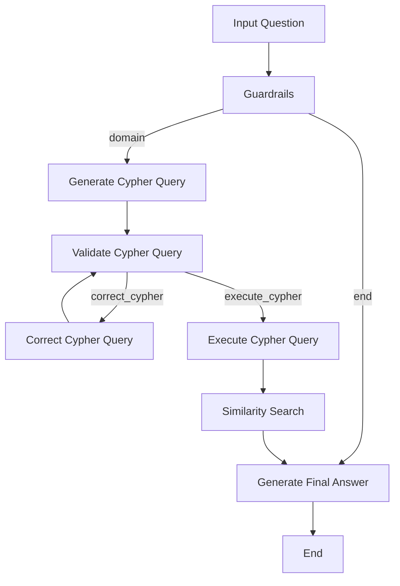

# Graph Querying System Documentation

## System Architecture

The system converts natural language questions into graph database queries through:
1. Guardrails verification
2. Few-shot query generation (Text2Cypher)
3. Query validation
4. Query correction
5. Query execution
6. Similarity search
7. Natural language answer generation

## Module Documentation

### 1. Guardrails Module
- **Purpose**: Domain validation
- **Components**: ChatPromptTemplate with structured output ("domain" or "end")

### 2. Cypher Query Generation (Text2Cypher)
- **Components**:
  - Few-shot example pairs
  - Text2Cypher chain
  - String parser for output

### 3. Query Validation and Correction
- **Components**:
  - Validation chain with schema-aware prompts
  - CypherQueryCorrector for relationship adjustments
  - Query correction chain

### 4. Similarity Search over Nodes
- **Purpose**: Semantic search on node embeddings
- **Implementation**: Neo4jVector with OpenAI embeddings
- **Usage**: Complements or replaces empty query results

### 5. Final Answer Generation
- **Purpose**: Combines all data into natural language response
- **Components**: Answer generation chain with structured output

## LangGraph State Machine



## Operational Modes

### 1. Interactive Mode
```bash
python query_graph.py "<YOUR QUERY HERE>"
```

### 2. Command-Line Mode
```bash
python query_graph.py "What is the cast of Casino?"
```

## Summary of Enhancements

### Guardrails
- Domain relevance validation

### Few-shot Cypher Generation
- Semantic similarity-based example selection

### Validation & Correction
- EXPLAIN query and LLM validation
- Automatic correction of invalid queries

### Similarity Search
- Node embedding search for enriched results

### Final Answer Generation
- Coherent natural language responses from combined data sources
