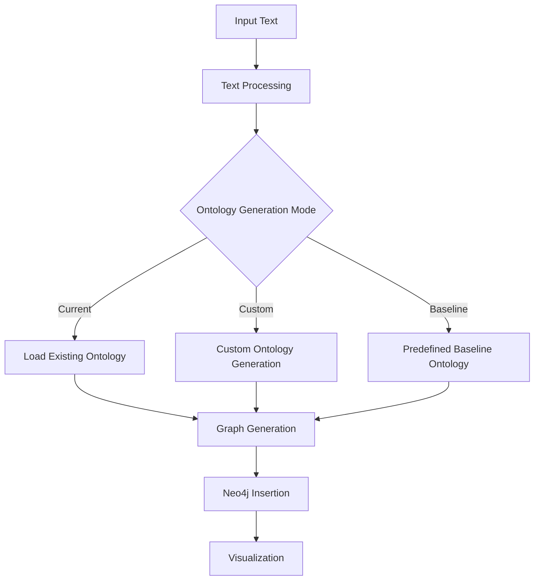

# Ontology Generation Enhancements and Usage Documentation

## Summary of Changes

### Two Ontology Modes (Expressive vs. Strict)

#### Expressive Ontology
- **Purpose**: Generate broad, generic ontology with high connectivity
- **Characteristics**:
  - Uses broad relationship types (AFFECTS, CONTAINS, DERIVESFROM, USES)
  - Allows multiple inheritance and circular references
  - Ideal for research and exploration

#### Strict Ontology
- **Purpose**: Generate precise, constrained ontology with clear rules
- **Characteristics**:
  - Uses strict relationship types (EXECUTES, CONTAINS, PRODUCES, etc.)
  - Enforces SUBCLASSOF format (ChildEntity -> ParentEntity)
  - Includes Pydantic validator
  - Limits nodes to one parent, no cycles
  - Ideal for production systems

### Conditional Structured Output Models
- RelationshipExpressive: Allows free-form descriptions
- RelationshipStrict: Enforces "ChildEntity -> ParentEntity" format

## Usage Documentation

### Execution Flow



### Operational Modes

#### 1. Current Mode
- **Description**: Uses latest exported ontology file from Neo4j
- **Usage**: `python memory_preprocessing.py --file transcript.txt --mode current --no-confirm`

#### 2. Custom Mode
- **Description**: Generates new ontology based on input text
  - **Expressive**: Broad categories, high connectivity
  - **Strict**: Precise constraints, validated relationships
- **Usage**:
  ```bash
  # Expressive
  python memory_preprocessing.py --file transcript2.txt --mode custom --ontology-mode expressive
  
  # Strict
  python memory_preprocessing.py --file transcript2.txt --mode custom --ontology-mode strict
  ```

#### 3. Baseline Mode
- **Description**: Uses predefined node and relationship labels
- **Usage**: `python memory_preprocessing.py --file transcript3.txt --mode baseline`

### Command-Line Arguments

| Flag | Description | Required |
|------|-------------|----------|
| --file | Input text file path | Yes |
| --mode | current, custom, or baseline | Yes |
| --ontology-mode | expressive (default) or strict | Only with --mode custom |
| --no-confirm | Skip user confirmation | No |
| --no-viz | Disable visualization | No |

## Summary

### Ontology Modes
- **Expressive**: Generic and flexible for exploration
- **Strict**: Constrained and validated for production

### Implementation
- Uses conditional Pydantic models
- Strict mode enforces "ChildEntity -> ParentEntity" format

### Usage
- Select mode via CLI arguments
- System applies appropriate enhancer logic
- Generates and inserts knowledge graph into Neo4j
