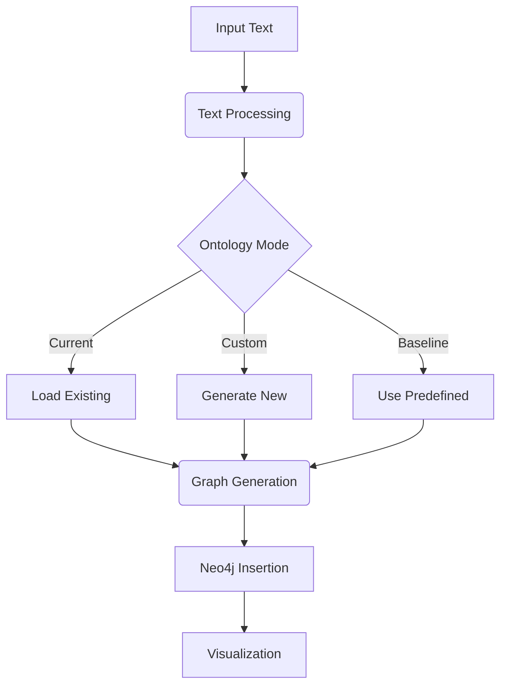

# Knowledge Graph Generation System Documentation

## System Architecture


The system consists of these core modules:
1. Text Processing
2. Ontology Management
3. Graph Generation
4. Neo4j Integration
5. Visualization
6. Ontology Export/Import

---

## Module Documentation

### 1. Text Processing Module (`load_data.py`)

#### `TextProcessor` Class
```python
class TextProcessor:
    def __init__(self, file_path: str):
        self.file_path = file_path

    def load_text() -> Optional[List[Document]]
```

**Responsibilities**:
- Load and concatenate text from input files
- Handle text loading errors
- Return LangChain Document objects

**Methods**:
- `load_text()`: Main entry point that:
  - Uses LangChain's TextLoader
  - Combines multi-page documents
  - Returns unified Document object

---

### 2. Ontology Management Module (`generate_graph.py`)

#### Core Classes:
```python
class OntologyEnhancer:
    def suggest_enhancements(text: str) -> Ontology
    def merge_ontologies(ontologies: List[Ontology]) -> Ontology
    def process_multiple_texts(texts: List[str]) -> Ontology

class Node(BaseModel):
    # Node type definition

class Relationship(BaseModel):
    # Relationship type definition
```

**Key Functionality**:
- Schema-aware ontology suggestions
- Multi-source ontology merging
- Interactive ontology review
- Existing schema integration

**Methods**:
- `suggest_enhancements()`: Generates new ontology elements based on text analysis
- `merge_ontologies()`: Combines multiple ontology suggestions using LLM
- `process_multiple_texts()`: Full processing pipeline with user interaction

---

### 3. Graph Generation Module (`generate_graph.py`)

#### `GraphGenerator` Class
```python
class GraphGenerator:
    def __init__(self, node_labels, relationship_labels)
    def generate_graph(documents) -> List[Document]
```

**Responsibilities**:
- Configure LLM graph transformer
- Generate knowledge graph triples
- Validate against allowed ontology
- Handle graph transformation errors

---

### 4. Neo4j Integration Module (`generate_graph.py`)

#### `Graph` Class
```python
class Graph:
    def __init__(self, uri, username, password)
    def add_graph(graph_documents) -> bool
```

**Functionality**:
- Manage Neo4j connection
- Bulk insert graph documents
- Transaction error handling
- Connection validation

---

### 5. Ontology Export/Import Module (`generate_from_file.py`)

#### Key Functions:
```python
def export_current_ontology_to_json() -> Dict
def get_nodes_rels_from_current_ontology_file() -> Tuple
```

**Features**:
- JSON-based ontology serialization
- Schema versioning
- Cross-environment ontology transfer
- Empty ontology detection

---

## Execution Flow


---

## Full System Documentation

### Environment Setup
```env
# .env file requirements
NEO4J_URI=bolt://localhost:7687
NEO4J_USERNAME=neo4j
NEO4J_PASSWORD=password
OPENAI_API_KEY=sk-...
```

### Installation
```bash
pip install -r requirements.txt
# requirements.txt
langchain_openai
langchain
neo4j
python-dotenv
inquirer
```

---

## Operational Modes

### 1. Interactive Mode
```bash
python memory_preprocessing.py
```

**Workflow**:
1. File path input
2. Mode selection menu
3. Real-time ontology review
4. Progress visualization

### 2. Command-Line Mode
```bash
python memory_preprocessing.py --file input.txt --mode current --no-confirm
```

**Arguments**:
| Flag | Description | Required |
|------|-------------|----------|
| `--file` | Input text file path | Yes |
| `--mode` | `current/custom/baseline` | Yes |
| `--no-confirm` | Skip confirmations | No |
| `--no-viz` | Disable visualization | No |

---

## Advanced Configuration

### Ontology Merging Logic
```python
# Custom merge prompt example
merge_prompt = """Merge guidelines:
1. Preserve domain-specific terms
2. Combine hierarchical relationships
3. Maintain AI/ML focus for baseline"""
```

### Visualization Settings
```python
class NodeSimilaritySearchMan:
    def visualize_relationship_graph_interactive()
```

**Features**:
- Interactive D3.js visualization
- Node similarity search
- Relationship filtering
- Export to HTML/PNG

---

## Best Practices

### Ontology Management
1. Version control `ontology.json`
2. Review suggestions in interactive mode first
3. Use separate namespaces for different domains
4. Regularly prune unused schema elements

### Performance Tips
- Batch process large text files
- Use `--no-viz` for automated pipelines
- Limit node properties to essential fields
- Increase Neo4j heap size for large graphs

---

## Troubleshooting Guide

| Error | Solution |
|-------|----------|
| Connection refused | Verify Neo4j service status |
| Empty ontology | Check input file content |
| API errors | Validate OpenAI quota |
| Visualization blank | Allow file:// protocol in browser |

---

## API Reference

### Core Methods

#### `generate()`
```python
def generate(file_path, viz=True, require_confirmation=True)
```
**Parameters**:
- `file_path`: Text document path
- `viz`: Generate visualization (default: True)
- `require_confirmation`: Interactive review (default: True)

---

## Example Use Cases

### Research Paper Analysis
```bash
python memory_preprocessing.py --file paper.txt --mode baseline
```

### Enterprise Knowledge Base
```bash
python memory_preprocessing.py --file kb/ --mode current --no-viz
```

### Dynamic System Modeling
```bash
python memory_preprocessing.py --file system_spec.md --mode custom
```

